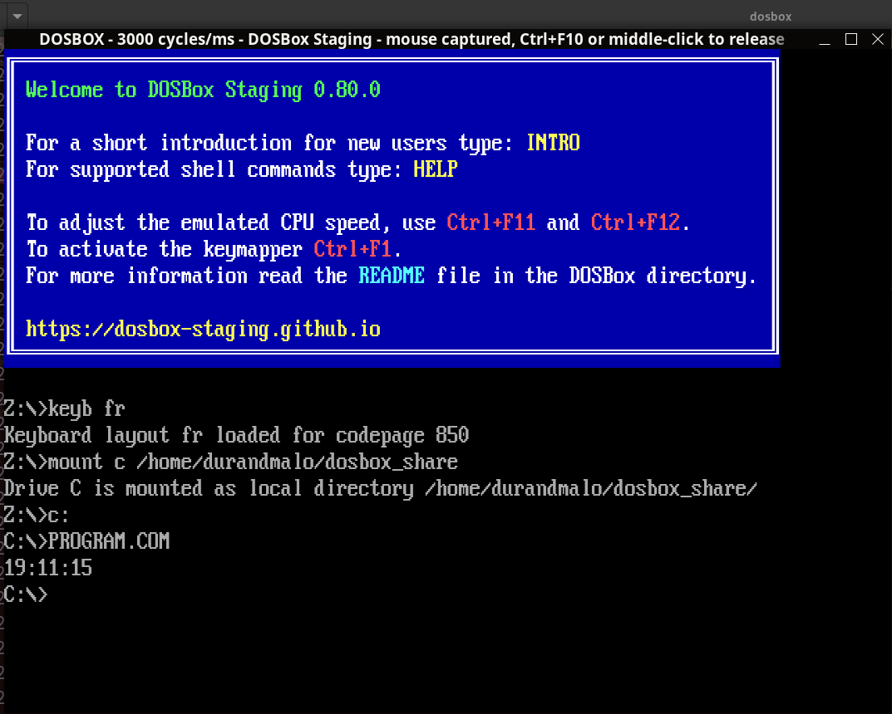

# Intel x8086 (NASM) DosBox Clock Reader

The program held in `program.asm` displays the time of the DosBox's clock with the following format : `HH:MM:SS`.

# Usage

### Install DOSBox emulator
Go to this website : [https://www.dosbox.com](https://www.dosbox.com/) and grab the DOSBox' version which fits your requirements.

### Compile the program
Install the [https://www.nasm.us/](https://www.nasm.us/) assembler and compile the `program.asm` file via the command : `nasm -fbin program.asm -o program.com`

[DOSBox syscall documentation](https://www.pcjs.org/documents/books/mspl13/msdos/encyclopedia/section5/)

### Run DOSBox
- Run the DOSBox emulator
- Mount the folder which contains the `program.com` that you compiled earlier : `Z:> mount C: C:\Users\user\Desktop\intel_x8086_clock`
- Go to the mounter folder : `Z:> C:`
- Run the `program.com` program : `C:\> PROGRAM.COM`

And then, you can run your DosBox to execute the program as following :

